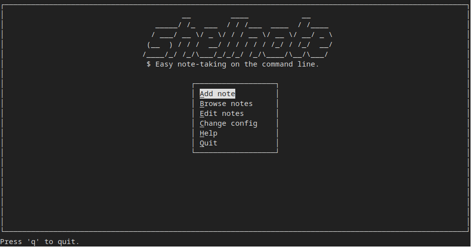

**WORK IN PROGRESS**

---

`shellnote2` is a refresh of [shellnote](https://github.com/mrtgst/shellnote-posix) written in Python (3.x). It retains the same CLI features, but adds a terminal UI for interactively adding and browsing your notes.
